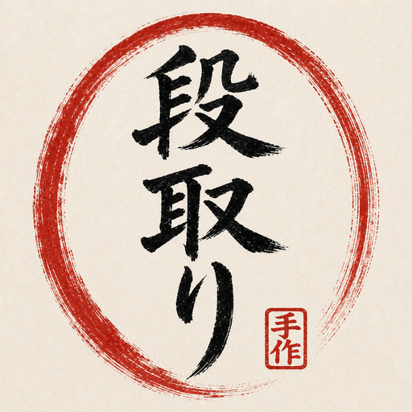
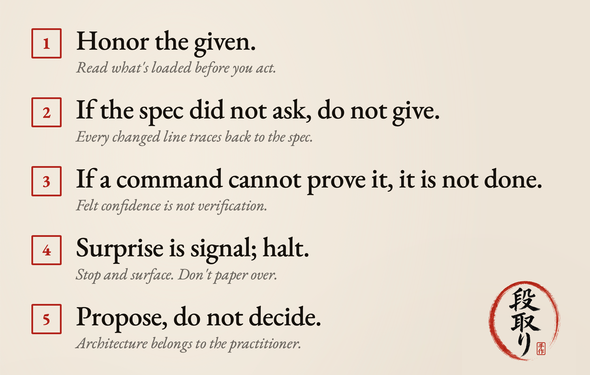
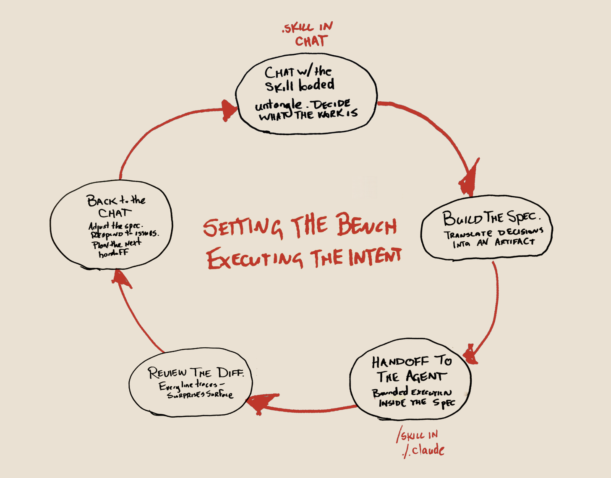

<p align="center">
  
</p>

<h1 align="center">Dandori</h1>

<p align="center"><em>Prep discipline for autonomous coding agents.</em></p>

<p align="center">
  <a href="#install">Install</a> ·
  <a href="#use">Use</a> ·
  <a href="#kokoroe-心得">Kokoroe</a> ·
  <a href="#why-it-exists">Why it exists</a>
</p>

---

You have a planning conversation in the chat. Dandori turns that conversation into a markdown spec at `agent-tasks/agent-task-YYYY-MM-DD-slug.md` — goal, files, required changes, acceptance criteria, verification commands, commit format. You hand the spec to an autonomous coding agent. The agent operates under five behavioral guidelines (kokoroe, installed once in `CLAUDE.md`) and executes the bounded task.

**Markdown only. No runtime. The skill is a methodology artifact, not a service.**

```
dandori/
├── SKILL.md       # entry point
├── KOKOROE.md     # the five guidelines
├── FORMAT.md      # the spec format reference
└── examples/      # three worked examples
```

---

## Install

Clone into your `.claude/skills/` directory:

```bash
cd .claude/skills
git clone https://github.com/sageframe-no-kaji/dandori.git
```

Install kokoroe at the project level so the agent loads it every session:

```bash
cat .claude/skills/dandori/KOKOROE.md >> CLAUDE.md
```

Or `@`-reference it from `CLAUDE.md`:

```
@.claude/skills/dandori/KOKOROE.md
```

That's it. Restart your session and the skill is available.

---

## Use

In any session with Claude Code (or a compatible agent):

```
/dandori I want to fix the FFmpeg pipe deadlock in Kanyō.
Interrogate me until you have everything you need, then
package the decisions as an agent task I can hand off.
```

Other shapes that trigger the skill:

- *"Draft me an agent task to bump fastapi from 0.110 to 0.115"*
- *"Package what we just decided as a spec"*
- *"Turn this conversation into something the agent can run"*

The skill interrogates you for what's missing, drafts the spec, and saves it. Worked examples live in [`examples/`](./examples).

A generated spec looks roughly like this:

```markdown
# Bump fastapi 0.110 → 0.115

**Goal:** Upgrade fastapi from 0.110.3 to 0.115.0 and ensure all tests pass.

**Files touched:**
- pyproject.toml (version pin)
- requirements.txt (regenerated lock)
- src/api/middleware.py (breaking change: middleware signature)

**Required changes:**
1. Update pyproject.toml: fastapi = "^0.115.0"
2. Run `uv lock` to regenerate requirements.txt
3. Update middleware.py signatures per 0.115 migration notes

**Acceptance:**
- `pytest tests/` passes
- `uv run python -m mypy src/` passes
- Manual smoke test on /health endpoint returns 200

**Verification commands:**
- `pytest tests/api/`
- `python -c "import fastapi; print(fastapi.__version__)"`

**Commit format:**
`deps(api): bump fastapi 0.110 → 0.115`
```

The agent reads this spec, executes inside it, and surfaces anything that doesn't match.

---

## Kokoroe (心得)

The agent operates under **kokoroe** — the practitioner's internalized discipline of care, intention, and specificity. Five guidelines, installable once in your project's `CLAUDE.md`:

<p align="center">
  
</p>

1. **Honor the given.** Read what's loaded before acting.
2. **If the spec did not ask, do not give.** Every changed line traces back to the spec.
3. **If a command cannot prove it, it is not done.** Felt confidence is not verification.
4. **Surprise is signal; halt.** Stop and surface findings rather than rationalize.
5. **Propose, do not decide.** Architecture belongs to the practitioner.

Without kokoroe, the spec gets honored but the *stance* doesn't carry — the agent will still try to "improve" things that weren't in scope. With it, the agent stops trying to be clever and executes the bounded thing it was given.

---

## The shape of the work

<p align="center">
  
</p>

The skill lives in two places. In the chat, where the planning happens. In the agent, where execution happens. Knowledge pendulates between them — each handoff back to the chat is where the spec gets adjusted, where issues surface, where the next bounded task gets shaped.

---

## Why it exists

Coding agents are fast and confident. They are also undersupervised — given a chat-shaped request, they treat it as an invitation to range. They overcomplicate. They decide architecture. They ship work no one asked for, because in conversational terms, more is generous.

The fix isn't a better prompt; it's a different artifact. A prompt is a sentence. A handoff is a spec — bounded, recorded, future-tense. Once the artifact exists, the agent's job stops being *infer what the user wants* and becomes *execute what the spec says*. Agents are good at executing what the spec says.

Dandori (段取り) is the Japanese trades word for the prep before the work — the carpenter's bench laid out before the saw bites, the chef's mise en place set before the burner is lit. The work goes smoothly because the dandori was thorough.

This skill is dandori for autonomous coding agents.

---

## Provenance

Dandori is part of the [Ho System](https://atmarcus.net), a methodology for human-AI collaboration. Each of the five koans came out of an essay in [Constructive Interference](https://sageframe.substack.com):

- **Honor the given** — [Walking Without Google Maps](https://sageframe.substack.com/p/walking-without-google-maps)
- **If the spec did not ask, do not give** — [Prompting, Not Programming](https://sageframe.substack.com/p/prompting-not-programming)
- **If a command cannot prove it, it is not done** — [Bad Vibes](https://sageframe.substack.com/p/bad-vibes)
- **Surprise is signal; halt** — [Walking Without Google Maps](https://sageframe.substack.com/p/walking-without-google-maps), the secret camino
- **Propose, do not decide** — [Thinking Outside the Skull](https://sageframe.substack.com/p/thinking-outside-the-skull)

The full argument lives in [Everybody Is Shipping Work Nobody Asked For](https://sageframe.substack.com/p/everybody-is-shipping-work-nobody).

---

## License

MIT.

---

<p align="center"><em>Andrew Todd Marcus</em></p>
<p align="center">
  <a href="https://atmarcus.net">atmarcus.net</a> ·
  <a href="https://sageframe.substack.com">sageframe.substack.com</a> ·
  <a href="https://pinkteaming.net">pinkteaming.net</a>
</p>
